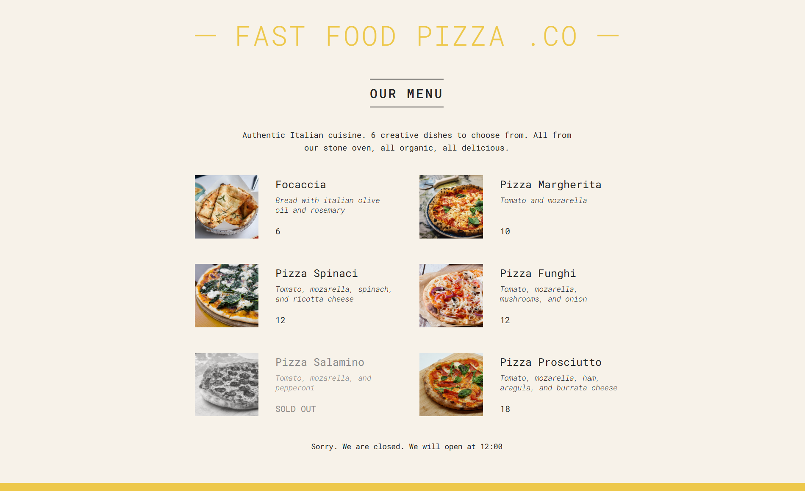

# Pizza Menu – React Project

A small project built as part of Jonas Schmedtmann’s React course.  
This app displays a simple pizza menu using React components, props, and JSX.

- Create and use **functional components**
- Pass and handle **props**
- Work with **JSX** syntax




## Run the project

```bash
npm install
npm start
```
